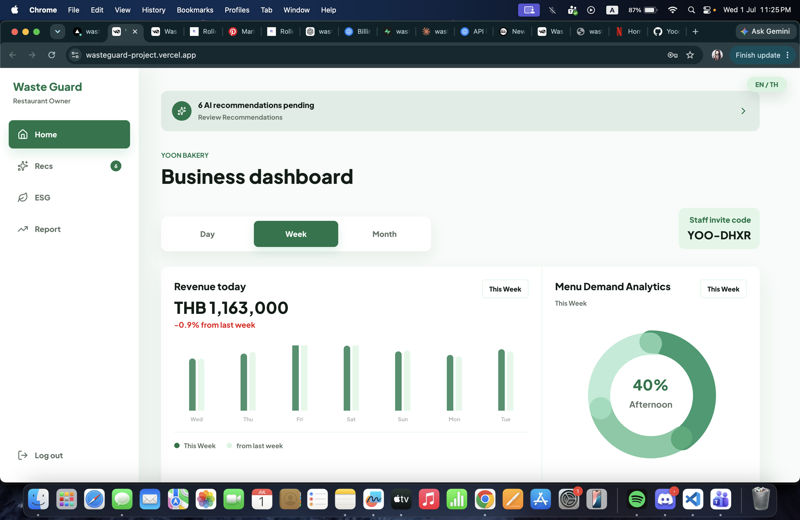
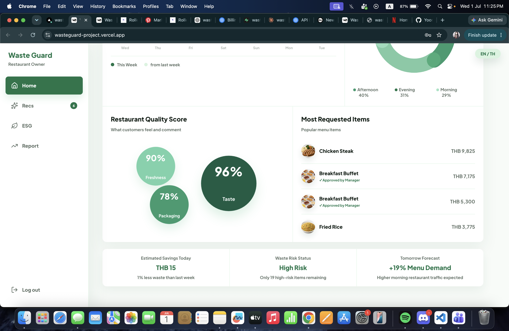

# Waste Guard

A food waste management platform built for hotels and restaurants. It tracks daily waste, forecasts menu demand, flags unusual patterns, and scores sustainability performance — all in one dashboard.

---

## Dashboard




---

## What it does

**For the owner**
- Daily revenue tracking with week-over-week comparison
- Menu demand analytics broken down by time of day (morning / afternoon / evening)
- Restaurant quality scores — freshness, taste, packaging
- Most requested items with revenue per item
- Estimated savings, waste risk status, and tomorrow's demand forecast
- AI-generated recommendations for reducing food waste and cutting costs
- ESG sustainability scoring (Environmental, Social, Governance)

**For staff**
- Preparation cards showing what to cook and how much
- Items approved by the manager are clearly marked
- Morning briefing popup for the owner on every sign-in

**AI engine (Python / Flask)**
- Random Forest model that forecasts how much of each menu item to prepare based on day of week, weather, and promotions
- Second Random Forest that predicts food waste, electricity, water, and gas usage
- Isolation Forest that flags unusual days — high waste, low customers, abnormal energy use
- Sustainability recommendations generated from the forecast output

---

## Tech stack

| Layer | Tools |
|---|---|
| Frontend | Next.js 15, React 19, TypeScript, Tailwind CSS v4 |
| Backend (auth + data) | Supabase |
| ML engine | Python, Flask, scikit-learn, pandas |
| Deployment | Vercel (frontend), Railway (Python engine) |

---

## Running locally

**Frontend**

```bash
npm install
npm run dev
```

Open [http://localhost:3000](http://localhost:3000).

**Python engine**

```bash
cd engine
pip install -r requirements.txt
python app.py
```

The engine runs on `http://localhost:5000` and the Next.js app will call it automatically when generating recommendations.

---

## Environment variables

Create a `.env.local` file in the project root:

```
NEXT_PUBLIC_SUPABASE_URL=your_supabase_url
NEXT_PUBLIC_SUPABASE_ANON_KEY=your_supabase_anon_key
NEXT_PUBLIC_FLASK_API_URL=http://localhost:5000
```

---

## Project structure

```
app/              → Next.js pages and layout
components/       → UI components (dashboard, recs, ESG, staff view)
lib/              → Data fetching, mock data, i18n, auth helpers
engine/           → Python ML engine (Flask API)
  app.py                      → API routes
  recommendation_engine.py    → Combines all forecasts into recommendations
  insight_menu_forecast.py    → Random Forest for menu demand
  insight_sustainability_forecast.py → Random Forest for resource usage
  insight_anomaly_detection.py → Isolation Forest for unusual days
  mock_datas.py               → Sample hotel data used for development
```

---

## Demo accounts

Sign up as **Owner** to see the full dashboard, recommendations, and ESG view.

Sign up as **Staff** using an invite code from the owner account — staff see the preparation cards and mark items as done.

---

## Using real data

The ML models currently train on sample data in `engine/mock_datas.py`. To use real data:

1. Replace the data loading functions in `mock_datas.py` to query your database
2. Make sure your data includes: date, menu item, sold quantity, weather, food waste, electricity, water, revenue
3. The models retrain automatically on each API call — no separate training step needed while the dataset is small

---

## Live demo

[wasteguard-project.vercel.app](https://wasteguard-project.vercel.app)
